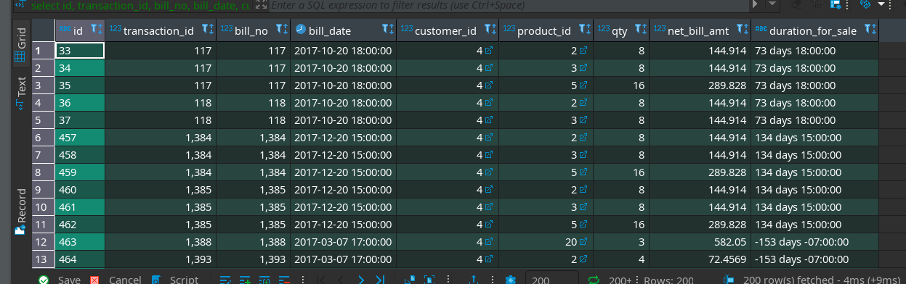
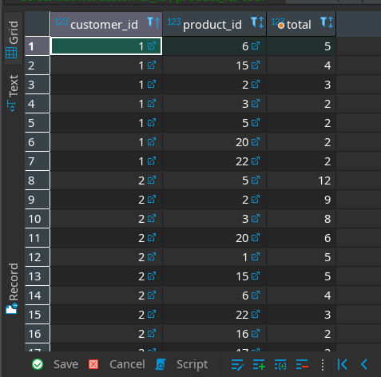

> ## Extract: 
The first process in ETL is Extraction.

Here we extract data from `.csv` to raw_tables.
There are three `.csv` files in Data/ i.e. `customer_dump - Sheet1.csv` , `procuct_dump - Sheet1.csv` and `sales_dump - Sheet1.csv`.

### e.g. [`extract_customer_data_from_csv.py`](../src/pipeline/extract_customer_data_from_csv.py) :

#### i. Imported necessary libraries:
```
from archieveTable import archieveTable
from database_connection import *
```
Here `database_connection` is the module made in pipeline directory which I have explained in [Documentation.md]() file. This helps in easy database connection.

The `archieveTable` helps to archieve tables described in [Documentaion.md]() as well.

#### ii. Function Defination 
I defined the `extract_customer_data_from_csv(filePath):` function which takes `filePath` as argument. `filePath` is the location of `.csv` file which is to be extracted into database.
```
def extract_customer_data_from_csv(filePath):
     ......
```
> #### Let me explain what this fuction does.

Fist of all, it connects to required database i.e. `etl_weekend` in my context. Then we define cursor to implement queries later.
```
 con = databaseConnect('etl_weekend')
 cur = con.cursor()
```

Now I declared the table where, data are to be extraceted.

```
tableName = 'raw_customer'
```

Lets empty this table before extraction :
```
cur.execute('DELETE FROM %s' %table_name)
```

Now I opened the dataset file as :
```
with open(filePath,'r') as file:
            #skip header row
            next(file)
            cur.copy_from(file,tableName,sep=',')
        con.commit()  
```
The `.csv` file is extracted into respective table_name using `psycopg2`'s `copy_from()` funntion.

After extracting the data, we archieve table as :
```
archieveTable('etl_weekend',tableName,filePath,'../sql/extract_raw_customer_archieve.sql')
```
The functioning of `archieveTable` module is explained in [Documentation.md]() file.

Then close the connection using `databaseDisconnect(con,cur)` declared in `database_connection` which we imported earlier.

#### iii. Function call with correct file-path:

Finally we call this funcion providing the correct `.csv` filepath.

```
extract_customer_data_from_csv('../../data/customer_dump - Sheet1.csv')
```
And the csv data was extracted to `etl_weekend` database into `raw_customer` table !

Similar approach was repeated to extract from other csv files. 
See : [`extract_product_data_from_csv.py`](../src/pipeline/extract_product_data_from_csv.py) and [`extract_sales_data_from_csv.py`](../src/pipeline/extract_sales_data_from_csv.py)


> ## Transform :
The second process in ETL is Transformation.

Data extracted into raw_tables are now transformed into standard tables.

### e.g. [`transform_customer.py`](../src/pipeline/transform_customer.py) :

#### i. Imported necessary libraries:
```
from archieveTable import archieveTable
from database_connection import *
```
Here `database_connection` is the module made in pipeline directory which I have explained in [Documentation.md]() file. This helps in easy database connection.

The `archieveTable` helps to archieve tables described in [Documentaion.md]() as well.

Now we connect to database as :

```
con = databaseConnect('etl_weekend')
cur = con.cursor()
```

This process is carried by two functions:
#### ii. Function Defination 
* I defined the `extract_location():` function which extracts/transform the data from `raw_customer` into `location` table.
```
def extract_location():
    try:
        extract_location_sql = file_content_toString('../sql/extract_location_from_raw.sql')
        cur.execute(extract_location_sql)
        con.commit()
        print('[+] Location Extracted from raw!')
    except Exception as e:
        print('[-] Exception Occured:',e)
```
> #### Let me explain what this fuction does.

Fist of all, it feteches the content of ['../src/sql/extract_location_from_raw.sql'](../src/sql/extract_location_from_raw.sql) file as string and puts in `extract_location_sql` variable. Then it is executed using the connection, which first deletes the content of `customer` -> `location` and then transforms data from `raw_customer`.

* Another function `extract_customers()` helps to transform `raw_customer` into `customer` table.
```
def extract_customers():
    try:
        extract_products_sql = file_content_toString('../sql/extract_customer_from_raw.sql')
        cur.execute(extract_products_sql)
        con.commit()
        print('[+] Customer Extracted from raw!')

    except Exception as e:
        print('[-] Exception Occured:',e)
``` 
It does so by using ['../src//sql/extract_customer_from_raw.sql'](../src/sql/extract_customer_from_raw.sql) sql file.


#### iii. Function call:

Finally we call the functions serially to load `location` table first then `customer` table.

```
if __name__ == '__main__':
    extract_location()
    extract_customers()
    databaseDisconnect(con,cur)
```
Then we close the connection.

And thus data was transformned to `etl_weekend` database into `location` table and `customer` table respectively !

Similar approach was repeated to transfrom data from raw_tables. 
See : [`transform_product.py`](../src/pipeline/transform_product.py) and [`transform_sales.py`](../src/pipeline/transform_sales.py)


> ## Load :
The last process in ETL is Load.

Data extracted into standard tables are now loaded into correct dimensions and facts.

### e.g. [`load_customer_dimension.py`](../src/pipeline/load_customer_dimension.py) :

#### i. Imported necessary libraries:
```
from archieveTable import archieveTable
from database_connection import *
```
Here `database_connection` is the module made in pipeline directory which I have explained in [Documentation.md]() file. This helps in easy database connection.

The `archieveTable` helps to archieve tables described in [Documentaion.md]() as well.

Now we connect to database as :

```
con = databaseConnect('etl_weekend')
cur = con.cursor()
```

This process is carried by two functions:
#### ii. Function Defination 
* I defined the `extract_dim_location():` function which load the data from `location` table into `dim_location` table.
```
def extract_dim_location():
    try:
        extract_dim_location_sql = file_content_toString('../sql/extract_dim_location.sql')
        cur.execute(extract_dim_location_sql)
        con.commit()
        print('[+] Dimension Location Extracted from Location!')
    except Exception as e:
        print('[-] Exception Occured:',e)
```
> #### Let me explain what this fuction does.

Fist of all, it fetches the content of ['../src/sql/extract_dim_location.sql'](../src/sql/extract_dim_location.sql) file as string and puts in `extract_dim_location_sql` variable. Then it is executed using the connection, which first deletes the content of `fact_sales` -> `dim_customer` -> `dim_location` and then load data from standard `location` table.

* Another function `extract_dim_customers()` helps to load the data from standard `customer` table into `dim_customer` dimension table.
```
def extract_dim_customers():
    try:
        extract_products_sql = file_content_toString('../sql/extract_dim_customer.sql')
        cur.execute(extract_products_sql)
        con.commit()
        print('[+] Dimension Customer Extracted from Customer!')

    except Exception as e:
        print('[-] Exception Occured:',e)
``` 
It does so by using ['../src/sql/extract_dim_customer.sql'](../src/sql/extract_dim_customer.sql) sql file.

Since, we are loading into respective dimensions and facts, we have to insert data in such a way that, it helps us easily for analysis.

e.g. Here, we have added `total_items_bought` column to see the number of items bought by respective customer.


#### iii. Function call:

Finally we call the functions serially to load `dim_location` table first then `dim_customer` table.

```
if __name__ == '__main__':
    extract_dim_location()
    extract_dim_customers()
    databaseDisconnect(con,cur)
```
Then we close the connection.

And thus data was loaded to `etl_weekend` database into `dim_location`  and `dim_customer` dimension tables respectively !

Similar approach was repeated to transfrom data from raw_tables. 
See : [`load_product_dimension.py`](../src/pipeline/load_product_dimension.py) and [`load_sales_fact.py`](../src/pipeline/load_sales_fact.py)

Thus, we completed the ETL process. 
Now, we can analyze the datas easily using these dimension and fact tables.

* ## Some analysis:

> #### Duration for sales of respective product :

```
SELECT id,
	transaction_id,
	bill_no,
	bill_date,
	customer_id,
	product_id,
	qty,
	net_bill_amt,
	duration_for_sale
FROM fact_sales ;
```

<p>

> #### No. of products bought by each customers :

```
SELECT DISTINCT  customer_id , product_id, count(product_id) AS total
FROM fact_sales s 
WHERE qty is not null
GROUP BY customer_id , product_id ORDER BY total desc;

```


